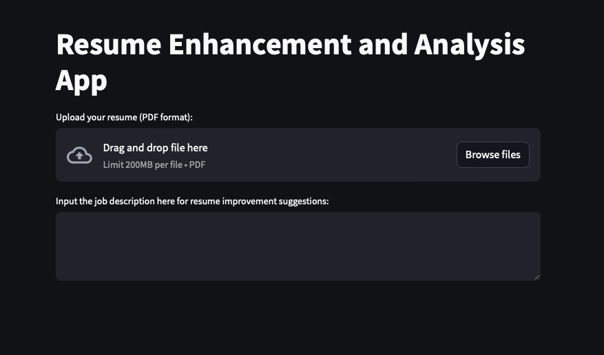
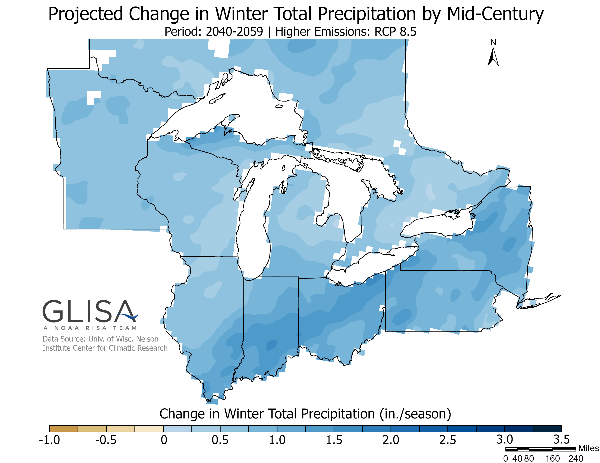
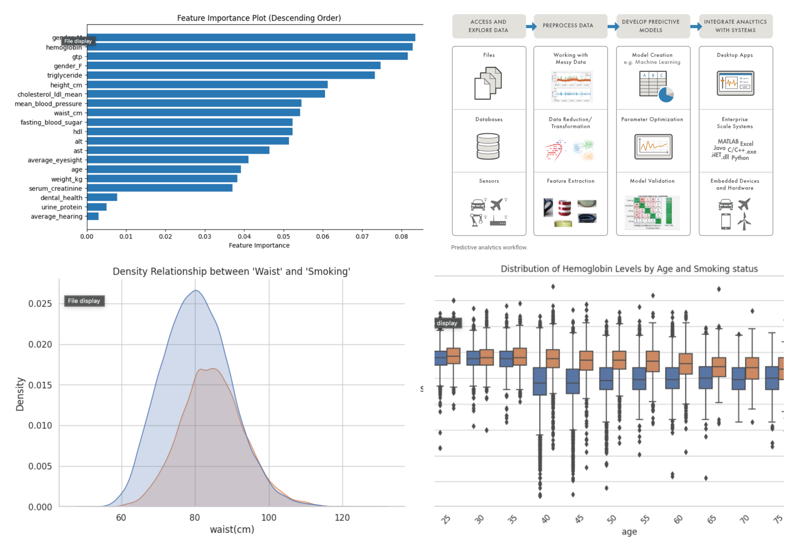

# My Data Science Portfolio
---
## Projects

### BERT Powered Resume Analysis App

This project aims to develop a web application designed to assist individuals in enhancing their resumes. Leveraging advanced Natural Language Processing (NLP) techniques, the application analyzes resumes, suggests improvements, and provides answers to user queries based on the resume content. App Link - [Hugging Face Link](https://huggingface.co/spaces/sanjay11/resumesimilarity)
- **Technologies Used:** Python, NLTK, Spacy, StreamLit, Transformers (BERT).
- **Link to Project:** [Project 1](https://github.com/TambeShruti/BERT-Powered-Resume-Analysis-App)
  
---

### Michigan Lake Precipitation Prediction

For my neural network course, my team and I built a ConvLSTM with encoder-decoder attention mechanism on satellite imagery and meteorological data to predict snowfall precipitation for the next 2days, achieved model performance F-1 score of 94%.
- **Technologies Used:** TensorFlow, Keras, Deep Learning, Image Data Processing, RNN-LSTM, ConvLSTM, Attention Mechanism
- **Link to Project:** [Project 2](https://github.com/TambeShruti/Michigan-Lake-Precipitation-Prediction/tree/main)

---

### Bio Signal Analysis for Smokers

This project employs Random Forest Classifier, SVM, Logistic Regression to predict smoking status with a 84% accuracy(RF). Through in-depth data exploration, crucial features like gender and hemoglobin levels were identified as key influencers in the relationship between health indicators and smoking behaviors. This endeavor contributes valuable insights to enhance personalized health interventions and predictive analytics in healthcare.
- **Technologies Used:** Exploratory Data Analysis, Data Visualization, Feature Engineering, Machine Learning, Outlier Detection, Model Evaluation using F-1 Score metric
- **Link to Project:** [Project 3](https://github.com/TambeShruti/Bio-Signal-Analysis-for-smoking-prediction/blob/main/Binary%20Classification.ipynb)

---

## Summary of Skills

- **Programming Languages:** Python, Java, C++, JavaScript
- **Data Science:** EDA, ETL, Hypothesis Testing, Supervised, Unsupervised ML, Deep Learning
- **ML Frameworks:** TensorFlow, Keras, NLTK, OpenCV, Pandas, NumPy, Matplotlib, Seaborn
- **Database Management:** Postgresql, MySQL, Oracle SQL, MongoDB
- **Tools:** Git, AWS, CI\CD, VS Code, Jupyter

---

## Experience

Software Engineer | Newgen Software | Mumbai, India | June 2021 - May 2022

- Built new features for a Java J2EE based banking software application in Agile methodology, resulting in a 20% increase in system functionality.
- Performed SQL queries and data analysis on account opening client data, reducing production issues and improved query execution time by 15%, optimized overall system response time.
- Added web UI to existing module, built a wizard for a form flow to engineer intuitive interfaces for user-friendly experience, decreasing common user defaults by 25%.
- Implemented optimizations of CRs in process specific .war files of KYC document verification, incorporated JavaScript for dynamic validations, resulting in enhanced form functionality.
- Collaborated with cross-functional teams, documented work, maintained code stability, corrected improperly coded loop, incorporated proactive problem solving of complex software issues efficiently.

---

## Education

**Master of Science in Information Systems**
*Northeastern University, Boston, MA*
*Expected May 2024*

**Bachelor of Engineering in Computer Engineering**
*Mumbai University, Mumbai, India*
*June 2021*

---

## Contact

- **LinkedIn:** [Shruti Tambe LinkedIn](https://www.linkedin.com/in/shrutitambe06/)
- **Email:** Tambe.sh@northeastern.edu
- **GitHub:** [GitHub Profile](https://github.com/TambeShruti)

## Acknowledgments

Inspiration - Chip Huyen [Chip Huyen](https://huyenchip.com)

## License

This portfolio is licensed under the [MIT License](LICENSE).
